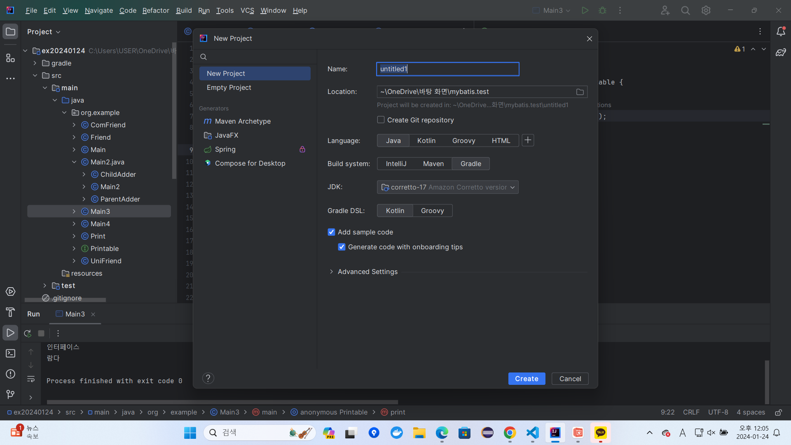
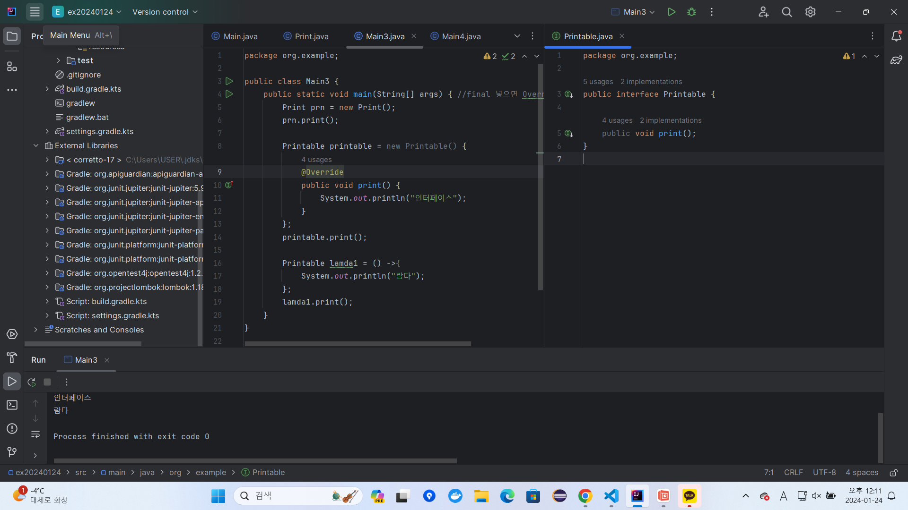
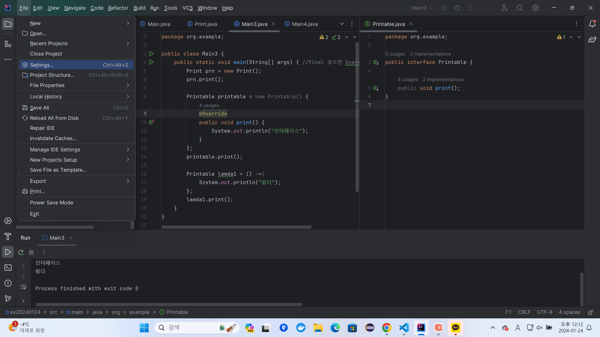
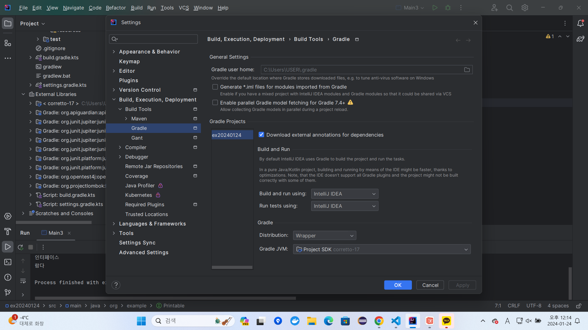
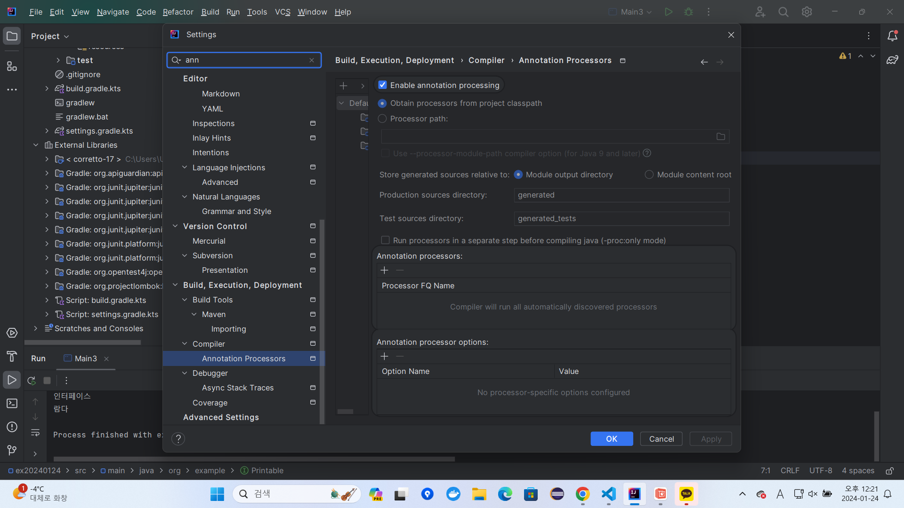

# 
intellij gradle 파일 만들기, lombok으로 인한 gradle 파일 출력 오류 고치기
 

## 
1. Intellij에서 gradle 파일 만드는 방법

* Generate code with onboarding tips는 Intellij 입문자면 설정하는 것을 추천하고 입문자가 아니라면 설정하지 않아도 된다. 

   

## 
2. lombok으로 인한 gradle파일 출력 오류 고치기

1. 먼저 main menu에 들어간다.

2. settings를 누른다.

3. Build Tools에 들어가서 그림과 같이 설정한다.

4. settings를 누르고 Annotation Professors에서 Enable annotation processing을 누르고 ok를 누른다.

5. 출력하면 해결된다.

