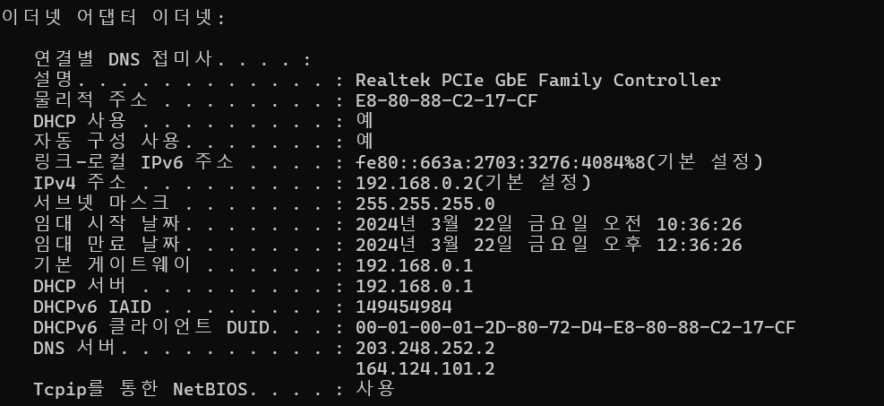
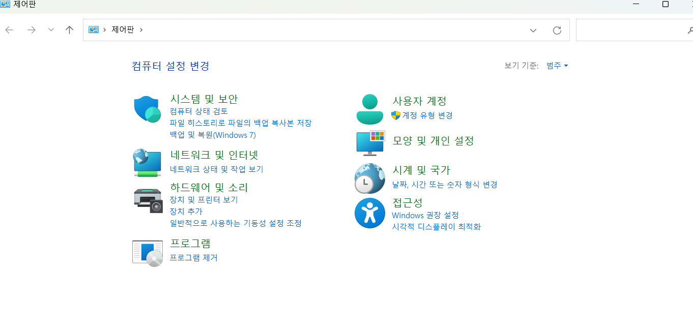
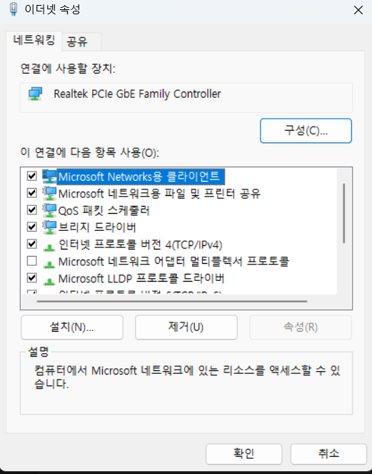
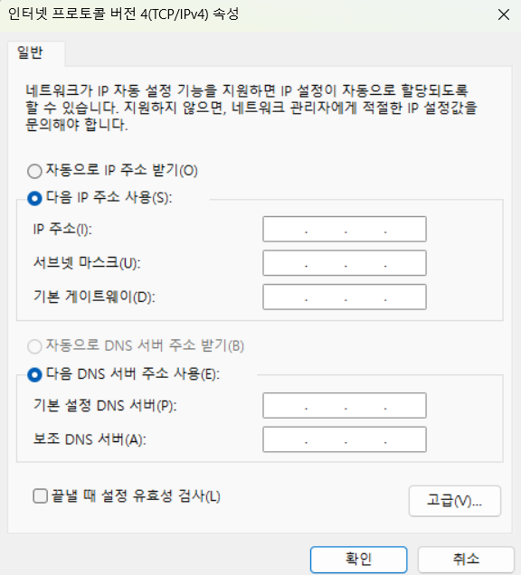

고정ip설정하기

      프로젝트를 하는 와중에 내 노트북 ip를 yml파일에 연결했다. 노트북을 껐다 키면 ip가 바꼈다. 그래서 구글링을 해보니 ip는 노트북을 껐다 키면 자동 설정 돼서 ip가 바뀐거였다.

      그래서 나는 ip를 고정시키는 방법을 검색해 보았고 방법을 찾았다.

      먼저 cmd창을 열어 ipconfig/all을 입력하면 아래 그림과 같이 나온다.

      

      IPv4주소, 서브넷마스크, 기본 게이트웨이, Dna서버 부분을 확인해야한다.

      

      제어판에서 네트워크 및 인터넷 네트워크 상태 및 작업보기 클릭하면

      

      어뎁터 설정 변경을 누르면 아래와 같은 그림이 나온다.

      

      이더넷을 오른쪽 클릭을 해서 속성을 누른다

       

      이더넷 속성에서 인터넷 프로토콜 버전 4를 더블클릭한다. 더블 클릭하면 아래와 같은 그림이 나온다. 다음 ip주소 사용을 누른다.

      

      확인한 IPv4주소, 서브넷마스크, 기본 게이트웨이, DNA서버 부분을 적어 변경한다.

